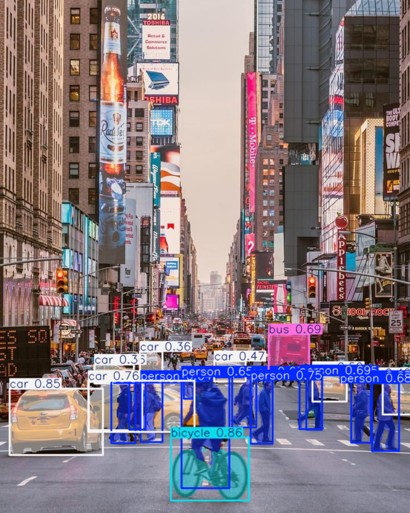
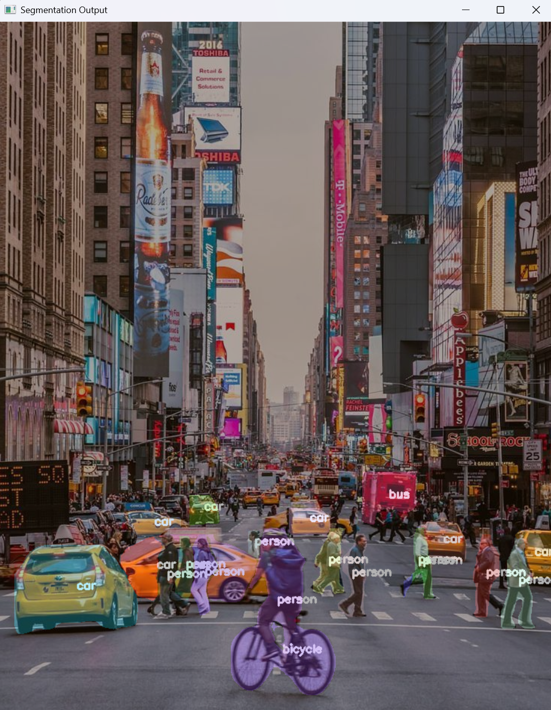
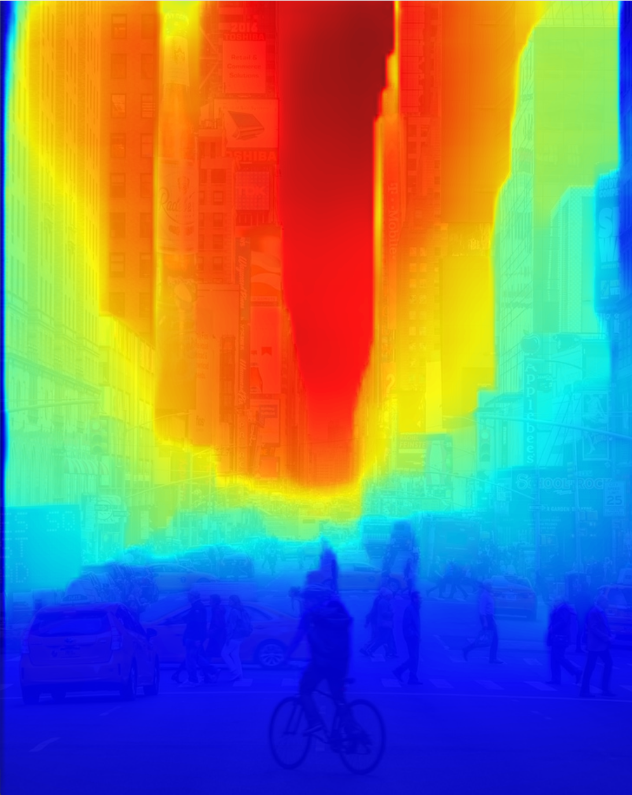
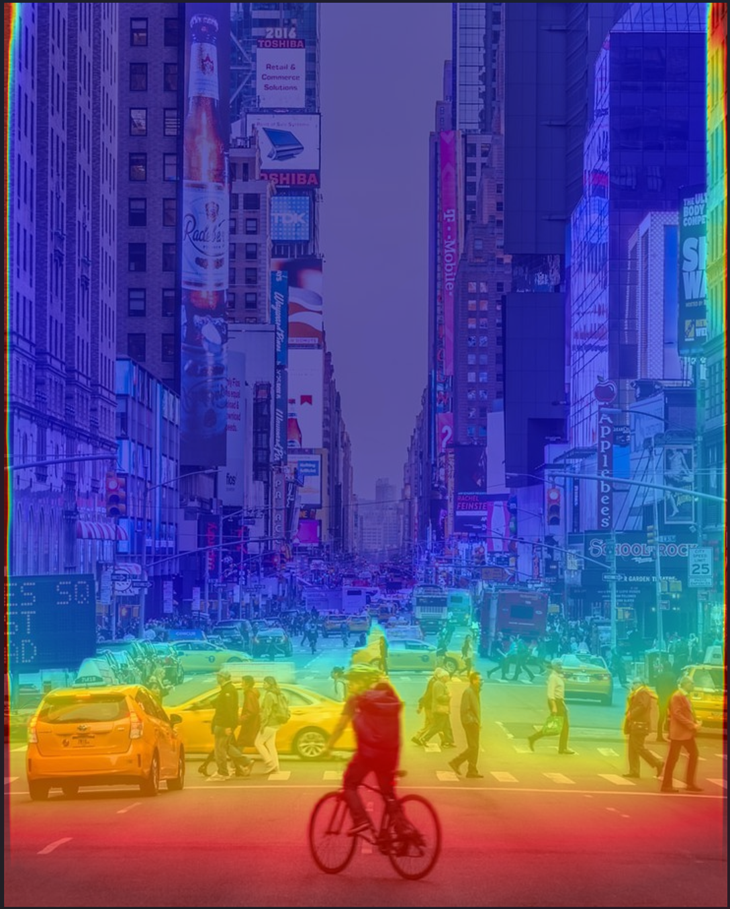
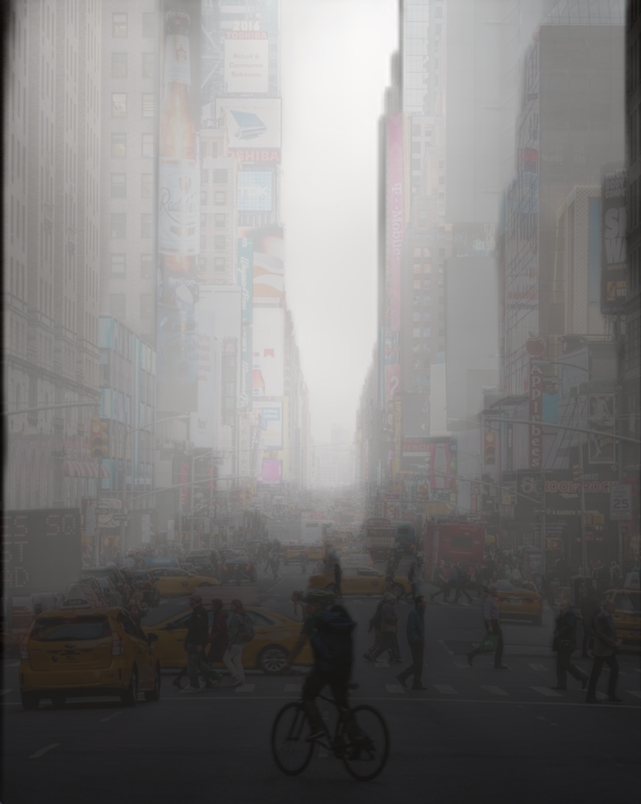
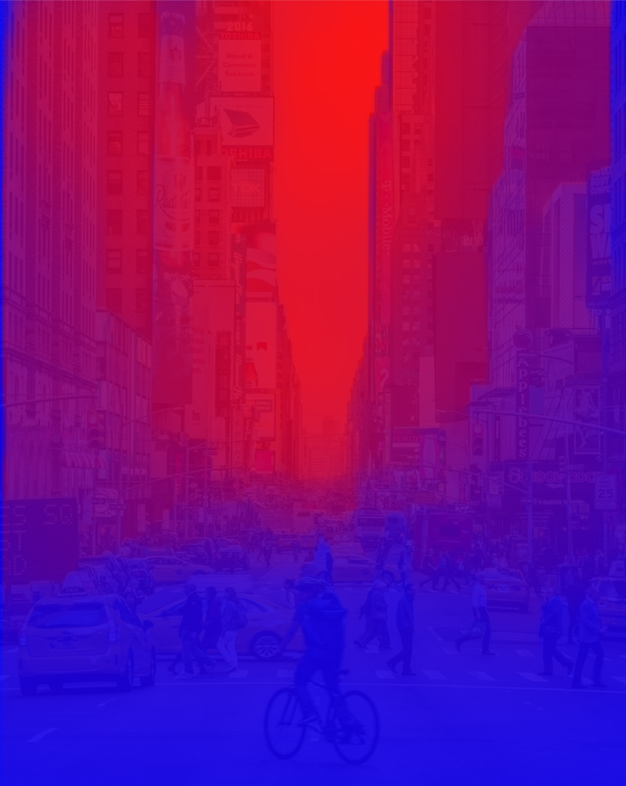
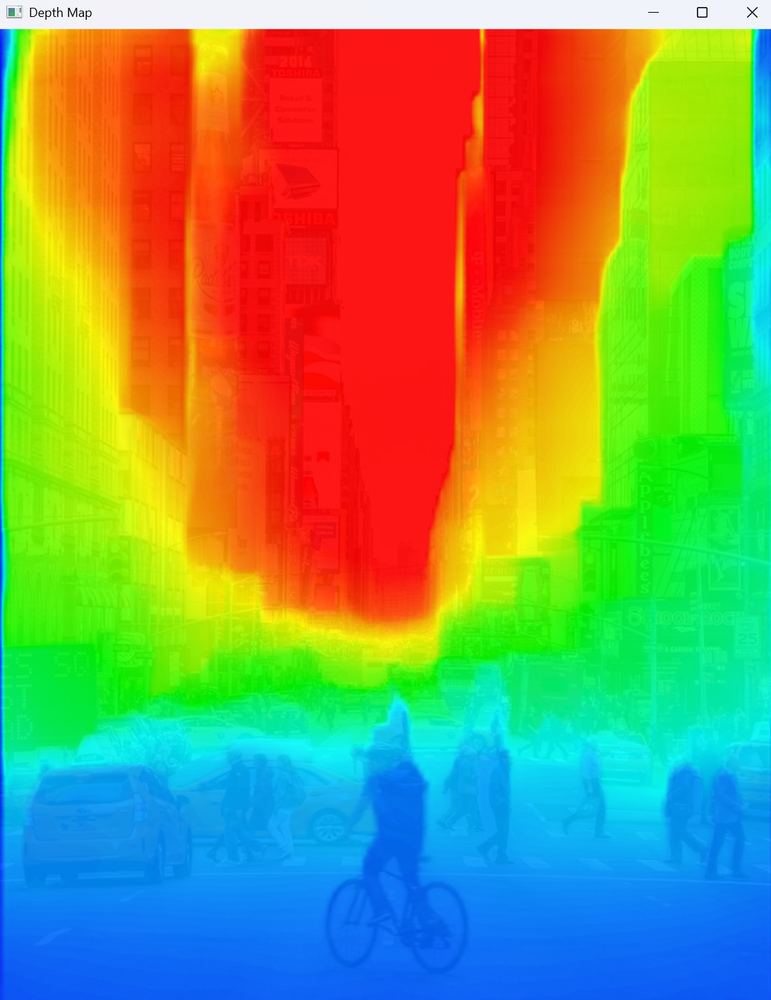
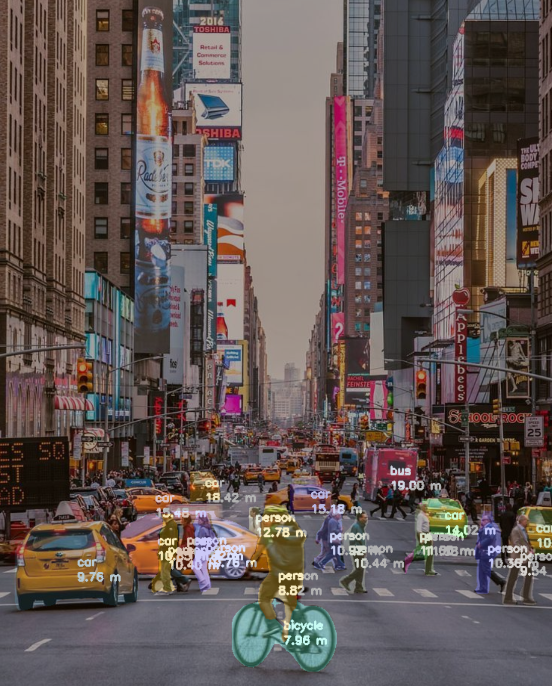

# Instance-Specific Depth Estimation

A computer vision project that combines **instance segmentation** and **monocular depth estimation** to estimate the depth of individual objects in an image.

The project uses two YOLO models:

* **YOLO11n-seg** for instance segmentation
* **YOLO26n-depth** for depth estimation

The main idea is to use the segmentation mask of each detected object to extract the corresponding pixels from the depth map. This allows the system to calculate a depth value specifically for each detected instance rather than only producing a depth map for the entire scene.

---

## What This Project Does

A depth estimation model produces a depth value for every pixel in an image, but it does not directly tell us which depth values belong to which object.

An instance segmentation model, on the other hand, tells us exactly which pixels belong to each detected object.

This project combines the two outputs:

For every detected instance, the program:

1. Gets its class.
2. Gets its segmentation mask.
3. Converts the mask into a binary mask.
4. Uses the binary mask to select the corresponding depth-map pixels.
5. Calculates the average depth of those pixels.
6. Displays the object class and estimated depth.
7. Visualizes the segmentation mask on the original image.

---

## Example Output

The final visualization shows each detected object with its class and estimated depth.

For example:

```text
person
2.31 m

car
5.47 m

bus
8.12 m
```

The displayed depth values depend on the depth model and input image.

---

## Models

### Instance Segmentation

The project uses:

```text
yolo11n-seg.pt
```

The segmentation model provides the individual masks and class information for detected objects.

The instance masks are accessed through:

```python
result.masks.data
```

Object class IDs are obtained from:

```python
result.boxes.cls
```

and mapped to class names using:

```python
result.names[class_id]
```

---

### Depth Estimation

The project uses:

```text
yolo26n-depth.pt
```

The depth model generates a depth map for the input image.

The depth data is obtained using:

```python
depth_map_result = depth_model(image)

depth_map = depth_map_result[0].depth.data
depth_map = depth_map.cpu().numpy()
```

The depth map is then used together with each segmentation mask.

> **Note:** The numerical output of a monocular depth model should not automatically be interpreted as a calibrated real-world distance in meters unless the specific model output is known to represent metric depth. The project currently displays the values using `m` as a visualization label based on the chosen model/output interpretation.

---


# Possible Future Improvements

Some possible extensions are:

* Compare mean and median depth
* Remove depth outliers
* Estimate the closest depth within each instance
* Use only the central region of an object mask
* Add confidence information
* Use consistent colors for instances
* Add object tracking
* Process video or a live camera
* Improve depth visualization
* Add obstacle-distance warnings
* Use the output for robot navigation
* Combine object depth with path planning
* Integrate the system with a mobile robot

---

# Here are the various output images generated throughout this project:

### Input image


# Instance Segmentation output

### YOLO's default plot function output


### My segmentation code output


---
# Depth Estimation Output

### OpenCV AutoDepth output


### YOLO AutoDepth output


### My Grayscale depth map


### My Bicolor depth map


### My Multi-color depth map


---
# Final Instance Specific Depth map output

### Instance-specific depth estimation


---

# Status

**Completed**

The current implementation successfully performs instance-specific depth estimation and visualization for detected objects.

The project is intentionally kept relatively simple so that the underlying data flow and implementation can be understood rather than hidden behind a larger framework.
